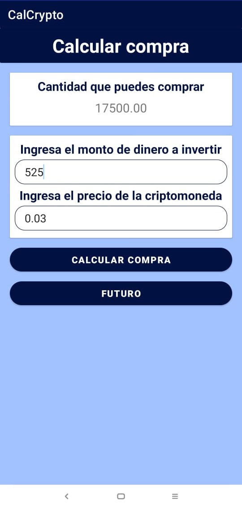
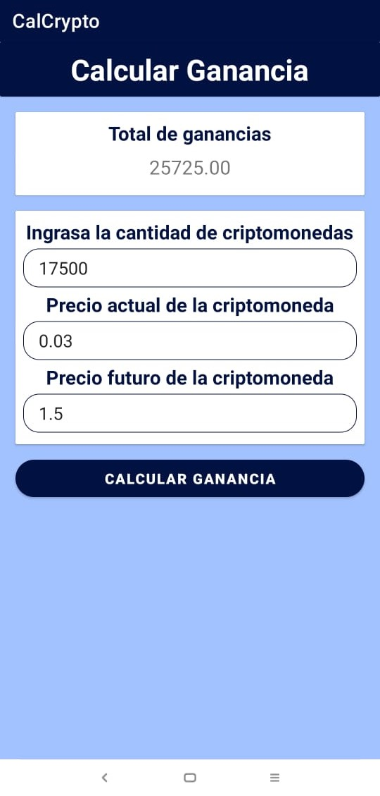
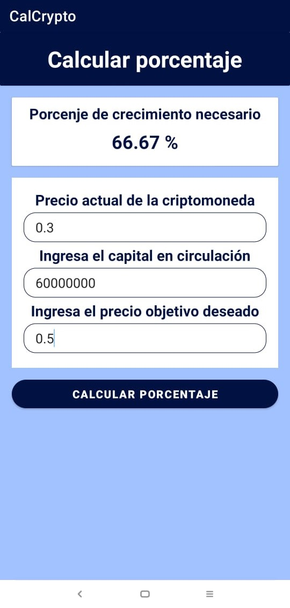

<h1>Aplicación android: criptomonedas</h1>

Esta es una aplicación basica desarrollada con Android Studio durante la etapa lectiva del programa de formación Analisis y Desarrollo de software. 

 

  

**Funcionalidad:**
- **Calcular compra:** Permite mostrar al usuario la catidad de criptomonedas (Tokens) que podria comprar segun la cantidad de dinero. 

        Cantidad de Criptomonedas = Precio de la Criptomoneda / Cantidad de Dinero
  

  

- **Calcular Ganancias:** Permite mostrar al usuario la ganacia total al realizar la venta de las criptomonedas (Tokens) a un determinado precio. 

        Ganancia = (Cantidad de criptomonedas * Precio de venta) - (Cantidad de criptomonedas * Precio de compra)
  
​

  

- **Calcular Porcentaje:** Permite mostrar al usuario el porcentaje de creciiento necesario para que la criptomoneda (Token) llegue a un determinado precio.

  

